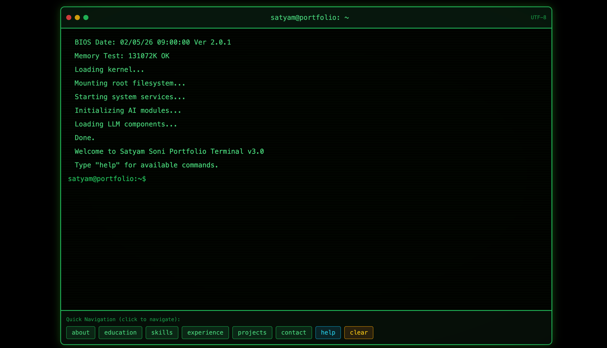

# 🖥️ Developer Terminal Portfolio

[](https://react.dev)
[](https://www.typescriptlang.org)
[](https://tailwindcss.com)
[](https://vite.dev)
[](https://opensource.org/licenses/MIT)

**A modern, interactive developer portfolio template** where visitors navigate your profile exactly like a real terminal — `cd projects`, `ls skills`, `cat experience.txt` and more!

Stand out instantly from boring scrollable portfolios. Built with React 19, TypeScript, Tailwind CSS & Vite.

**[🔗 Live Demo](https://www.satyamsoni.com)** • **[⭐ Star the Repo](https://github.com/satyamsoni2211/developer_portfolio)** • **[Fork & Use as Template](https://github.com/satyamsoni2211/developer_portfolio/fork)**



> _Tip: Record a quick 10–15 second GIF of someone typing `cd projects` → `ls` → `cat ...` and replace the image above. It dramatically increases engagement on GitHub._

## ✨ Features

- 🖥️ Full terminal-like experience with **tab completion**, **command history**, and classic commands
- 🌐 Every portfolio section is a "directory" you can `cd` into
- 📱 Fully responsive design
- 🌑 **Dark mode only** - Classic terminal aesthetic with CRT scanline effects
- 💼 Professional experience & projects showcase
- 🛠️ Comprehensive skills section organized by category
- ♿ Accessible & SEO-friendly
- ⚡ Lightning fast thanks to Vite + modern React
- 🎮 Boot sequence animation for authentic terminal feel

## 🖥️ Terminal Commands Cheat Sheet

```bash
satyam@portfolio:~$ help
# Shows this exact command list
```

| Command           | What it does                        | Example                     |
| ----------------- | ----------------------------------- | --------------------------- |
| `help`           | List all available commands         | `help`                      |
| `ls`             | Show available sections & files     | `ls`                        |
| `cd <section>`   | Navigate to a section              | `cd projects`               |
| `cd ..`          | Go back to home directory          | `cd ..`                     |
| `pwd`            | Print current working directory    | `pwd`                       |
| `cat <file>`     | Display file contents              | `cat about.txt`             |
| `whoami`         | Show your personal info            | `whoami`                    |
| `clear` / `cls`  | Clear the terminal screen          | `clear`                     |
| `history`        | Show previous commands             | `history`                   |
| `exit` / `logout`| Close the terminal session        | `exit`                      |

**Pro moves**: Press **Tab** to autocomplete • Use **↑ / ↓** arrows for command history

## 🚀 Quick Start

### 1. Clone & Install

```bash
git clone https://github.com/satyamsoni2211/developer_portfolio.git
cd developer_portfolio
npm install
```

### 2. Development

```bash
npm run dev
```

→ Open http://localhost:5173

### 3. Production Build

```bash
npm run build
```

## 🛠️ Personalization (takes ~5–10 minutes)

All important content lives in **`src/App.tsx`** in the `PORTFOLIO_DATA` constant:

| Field           | What to change                                        |
| --------------- | ----------------------------------------------------- |
| `name`          | Your name                                            |
| `role`          | Your job title                                       |
| `location`      | Your location                                        |
| `email`         | Your email address                                   |
| `github`        | Your GitHub profile URL                              |
| `linkedin`      | Your LinkedIn profile URL                            |
| `website`       | Your personal website                                |
| `bio`           | Your biography                                       |
| `skills`        | Technical skills organized by category               |
| `experience`    | Work history (company, role, period, description)  |
| `education`     | Education details                                    |
| `projects`      | Featured projects with tech stack                   |
| `contact`       | Contact information                                  |

**Example – editing your info** (`src/App.tsx`):

```tsx
const PORTFOLIO_DATA = {
  name: 'Your Name',
  role: 'Full Stack Developer',
  location: 'New York, USA',
  email: 'you@example.com',
  github: 'https://github.com/yourusername',
  linkedin: 'https://linkedin.com/in/yourusername',
  website: 'https://yourwebsite.com',
  bio: `Your bio here...`,
  skills: {
    languages: ['JavaScript', 'TypeScript', 'Python'],
    frameworks: ['React', 'Node.js', 'Express'],
    // ... more categories
  },
  // ... more fields
};
```

## 📁 Folder Structure

```
src/
├── App.tsx              ← Main app with PORTFOLIO_DATA + terminal logic
├── App.css              ← Terminal-specific styling
├── main.tsx             ← Entry point
├── index.css            ← Global styles
├── hooks/
│   └── use-mobile.ts    ← Mobile detection hook
└── components/
    └── ui/              ← Reusable UI components (from shadcn/ui)
```

## 🚀 Deployment

The project includes GitHub Actions workflows for automatic deployment to Vercel:

| Workflow          | Trigger        | Description           |
| ----------------- | -------------- | --------------------- |
| `vercel.yml`     | Push to `main`| Production deployment |
| `vercel-preview.yml` | PRs        | Preview deployments  |

### Vercel Setup

1. Create a Vercel account and connect your GitHub repository
2. Generate a Vercel token: [Account Settings → Tokens](https://vercel.com/account/tokens)
3. Add these **GitHub Secrets**:
   - `VERCEL_TOKEN` - Your Vercel access token
   - `VERCEL_ORG_ID` - Run `vercel link` locally to get this
   - `VERCEL_PROJECT_ID` - Run `vercel link` locally to get this

### Alternative: Netlify

The project also includes a Netlify workflow at `.github/workflows/netlify.yml`.

## 🤝 Contributing

Bug reports, new command ideas, design improvements, or theme suggestions are very welcome!

1. Fork the repo
2. Create your feature branch (`git checkout -b feature/amazing-command`)
3. Commit your changes (`git commit -m 'Add some amazing command'`)
4. Push to the branch (`git push origin feature/amazing-command`)
5. Open a Pull Request

## 📜 License

MIT © [Satyam Soni](https://github.com/satyamsoni2211)

---

Made with ❤️ and way too much time spent typing `cd` instead of clicking
