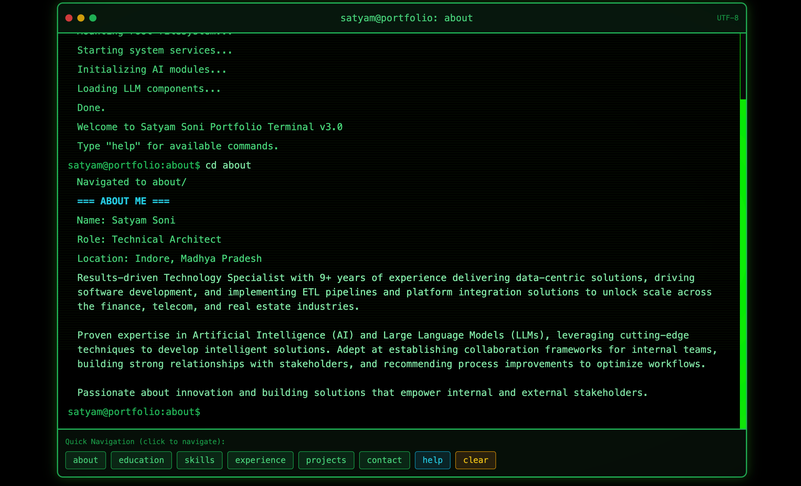

# Developer Portfolio

<p align="center">
  
</p>

A modern, responsive developer portfolio template built with React, TypeScript, Tailwind CSS, and Vite. Features a unique **terminal-based UI** that lets visitors interact with your portfolio like a developer!

[**Live Demo**](https://www.satyamsoni.com) &nbsp;

---

## ✨ Features

- 🖥️ **Terminal-Based Interaction** - Navigate the portfolio using familiar CLI commands
- 🎨 **Modern UI** - Clean typography with smooth animations
- 📱 **Fully Responsive** - Looks great on all devices
- 🌙 **Dark/Light Mode** - Automatic system theme detection
- 💼 **Projects Showcase** - Filterable projects with detailed cards
- 🛠️ **Skills Section** - Display your tech stack elegantly
- 📧 **Contact Form** - Form validation with React Hook Form + Zod
- ♿ **Accessible** - WCAG compliant components
- 🔍 **SEO-Friendly** - Optimized for search engines

---

## 🖥️ Terminal Mode

This portfolio emulates a terminal interface. Users can:

```bash
satyam@portfolio:projects$ help
   === AVAILABLE COMMANDS ===
   help - Display available commands
   ls - List sections or files in current directory
   cd - Change to a section (e.g., cd projects)
   cat - Display content of a file (e.g., cat about.txt)
   clear - Clear the terminal screen
   exit - Close the terminal session
   whoami - Display user information
   pwd - Show current directory
   history - Show command history
   Tip: Use Tab for auto-completion, Up/Down for command history

satyam@portfolio:projects$ cd projects
   Navigated to projects/

   === FEATURED PROJECTS ===
```

---

## 🚀 Getting Started

### Prerequisites

- Node.js (v18 or higher)
- npm or yarn

### Installation

1. **Clone the repository:**

   ```bash
   git clone <your-repo-url>
   cd developer_portfolio
   ```

2. **Install dependencies:**

   ```bash
   npm install
   ```

3. **Start the development server:**

   ```bash
   npm run dev
   ```

4. **Open** [http://localhost:5173](http://localhost:5173) in your browser

### Building for Production

```bash
npm run build
```

---

## 🌐 Deployment

The project includes GitHub Actions workflows for automatic deployment to Vercel:

| Workflow             | Trigger        | Description           |
| -------------------- | -------------- | --------------------- |
| `vercel.yml`         | Push to `main` | Production deployment |
| `vercel-preview.yml` | Pull requests  | Preview deployments   |

### Vercel Setup

1. Create a Vercel account and connect your GitHub repository
2. Generate a Vercel token: [Account Settings → Tokens](https://vercel.com/account/tokens)
3. Add these **GitHub Secrets**:
   - `VERCEL_TOKEN` - Your Vercel access token
   - `VERCEL_ORG_ID` - Run `vercel link` locally to get this
   - `VERCEL_PROJECT_ID` - Run `vercel link` locally to get this

---

## 🎨 Customization

### Update Personal Information

Edit the configuration files in `src/lib/`:

| File          | Purpose                           |
| ------------- | --------------------------------- |
| `config.ts`   | Name, bio, social links, metadata |
| `projects.ts` | Your projects data                |
| `skills.ts`   | Skills and technologies           |

### Theme Customization

- **Colors & Styling:** Modify `tailwind.config.ts`
- **CSS Variables:** Update `src/index.css`

### Adding New Sections

1. Create a new component in `src/components/`
2. Add it to the main page in `src/App.tsx`

---

## 🛠️ Tech Stack

<div align="center">


</div>

- [React](https://react.dev/) - UI library
- [TypeScript](https://www.typescriptlang.org/) - Type safety
- [Vite](https://vite.dev/) - Build tool
- [Tailwind CSS](https://tailwindcss.com/) - Styling
- [Radix UI](https://www.radix-ui.com/) - Accessible components
- [Framer Motion](https://www.framer.com/motion/) - Animations

---

## 📸 Screenshots

<p align="center">
  
</p>

---

## 📄 License

MIT License - Feel free to use this template for your own portfolio!

---

<div align="center">
  Made with ❤️ using React + Vite
</div>
