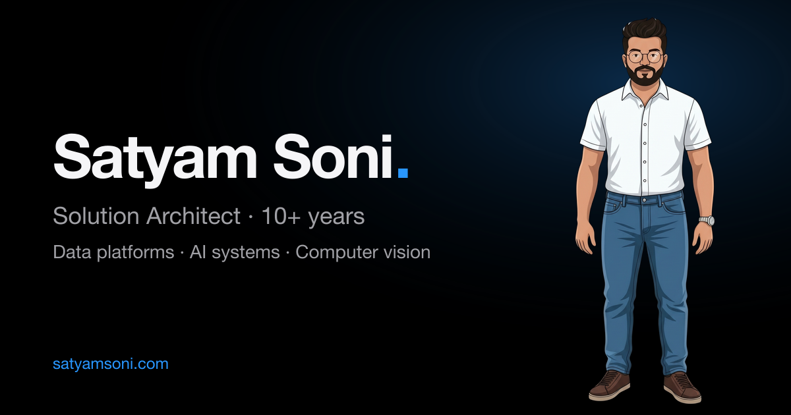

# Satyam Soni — Portfolio

Personal portfolio of **Satyam Soni, Solution Architect** — an Apple-inspired, theme-aware site with a 2D animated guide (Satyam's illustrated character) that follows your cursor and points out what's worth seeing.

**Live:** https://www.satyamsoni.com



## Features

- Light & dark themes that follow your OS, with a manual override
- Scroll-driven reveals, parallax hero, count-up stats, animated experience timeline
- 9 project case studies (3 computer-vision collaborations + 6 enterprise platforms) with animated architecture diagrams
- Card → case-study morph using the View Transitions API
- Guide character: head and eyes track the cursor, trails it as a companion, offers section tips, docks on touch devices, respects *Reduce motion*
- Fast: lazy-loaded routes, ~100 KB of character art, no web fonts

## Stack

React 19 · TypeScript · Vite · Tailwind CSS · Motion · React Router · Lenis · Vitest

## Develop

```bash
npm install
npm run dev        # http://localhost:5173
npm test           # unit tests
npm run build      # production build to dist/
```

## Editing content

All content is typed data in `src/data/`:

| File | Contents |
| --- | --- |
| `profile.ts` | name, role, contact links, bio, pillars, industries |
| `experience.ts` | roles, newest first |
| `projects.ts` | case studies — services, models, tech, metrics, architecture graph |
| `skills.ts` | skill categories and the marquee list |
| `education.ts` | degree |

Guide tips live in `src/guide/tips.ts`.

## Character art

`assets-src/character/character.svg` is the source illustration. Regenerate the layered WebP files, `layout.json` and the Open Graph image with:

```bash
npm run assets
```

Crop boxes and eye positions are constants at the top of `scripts/build-character.mjs`.

## Contact form

The contact form posts to [Web3Forms](https://web3forms.com), which emails each message to the address the access key was created for.

The access key is read from `VITE_WEB3FORMS_KEY`.

1. Local: copy `.env.example` to `.env.local` (git-ignored) and set the key.
2. Production: add `VITE_WEB3FORMS_KEY` to the Vercel project's environment variables and redeploy.

Without a key the form still works: submitting opens a pre-filled email draft instead.

## Deploy

Pushing to `main` runs `.github/workflows/vercel.yml`, which builds and deploys to Vercel production. Pull requests build only. Required secrets: `VERCEL_TOKEN`, `VERCEL_ORG_ID`, `VERCEL_PROJECT_ID`.

## License

MIT © Satyam Soni
